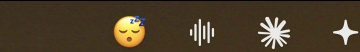

# mood-bar

A macOS desktop that follows what you're actually doing. It reads the machine for
signs of focus, load and tiredness, picks a mood from them, and matches your
wallpaper, light/dark mode, accent color and — optionally — every app icon in the
Dock to it. A one-emoji menu bar indicator tells you which mood is on screen.

<p align="center">
  
</p>

```console
$ mood-wallpaper.sh --explain
mood:   focused
source: signals

SIGNALS OBSERVED
  time               13:00
  idle               0s (at the machine)
  frontmost          Code [dev]
  apps open          9
  playing            nothing

VOTES CAST
  time     energetic    1.0   13h afternoon
  time     focused      0.8   13h afternoon
  app      focused      3.0   Code (dev)
  load     stressed     0.7   9 apps open

SCORES
  -> focused    3.8
     energetic  1.0
     stressed   0.7
```

The work is daemon-free: `launchd` wakes a shell script every 15 minutes, it
does its job in ~1–3 seconds and exits. The only thing that stays resident is
the menu bar indicator, which is optional.

**Requirements:** macOS 14 or newer (tested on 26.5), Xcode command line tools
for `swiftc`. No Homebrew, no Python, no runtime dependencies.

---

## Footprint

Measured on an M-series MacBook, default settings (a wallpaper change at most
every 30 minutes, launchd waking every 15):

| | CPU | How often |
|---|---|---|
| Wake, decide nothing is due, exit | 0.03s | 96×/day |
| Full run, with a download | 0.86s | ≤48×/day |
| Full run, offline | 0.55s | — |
| Menu bar indicator, resident | ~2.8s | per day, total |

**≈45 seconds of CPU per day**, or about 0.05% of one core. A full run takes
~8s of wall-clock time but only 0.86s of CPU — the rest is waiting on the image
download, during which the CPU is idle.

Things that were slower than they needed to be, and now aren't:

| | Before | After |
|---|---|---|
| Reading a wallpaper's colour | 133ms | 30ms |
| Re-applying the picture already on screen | 759ms | 42ms |
| Re-applying the appearance already in effect | 535ms | 34ms |
| Menu bar indicator, idle | ~10s/day | ~2.8s/day |

The wins are mostly about *not doing work*: skipping the wallpaper store write
and the `WallpaperAgent` restart when the picture is already up, skipping the
icon-style save when it is already in effect (saving re-renders every icon on
the machine), and decoding wallpapers straight to thumbnail size instead of
unpacking 4K to throw away 99.9% of the pixels.

The menu bar indicator no longer redraws on every check — assigning to a status
item forces a menu bar relayout even when the value is identical, so it now
compares against what is already drawn and does nothing if they match. A burst
of state writes from one run is coalesced into a single refresh, and the backstop
timer runs every 5 minutes with a 60s tolerance so the system can fold it into
wakeups it was making anyway.

On the shell side, `detect-mood.sh` used to fork `awk` once per signal — eleven
processes to read eleven strings already in memory — and now parses the sample
with shell builtins. The now-playing AppleScript costs 0.2–0.6s and is the
single most expensive thing in a run, so it is skipped entirely unless
`NSWorkspace` has already reported that a music app is running.

---

## Install

```sh
git clone https://github.com/Adityaraj142857/mood-bar.git
cd mood-bar
./install.sh
```

That builds the two Swift binaries, creates `config.conf`, and loads the launchd
agents. Then add an API key (optional, see below) and run it once by hand:

```sh
./mood-wallpaper.sh --force
```

The first run triggers macOS permission prompts — Automation → System Events,
and Music/Spotify if they're open. Approve them once; it's silent afterwards.

To remove: `./uninstall.sh`, or `./uninstall.sh --restore` to also hand the
desktop picture back to a macOS default.

> The launchd agents are labelled `com.arshukla.*`. Rename them in the two
> `.plist` files and `install.sh` if you'd rather they carried your own domain.

---

## What it can and cannot know

This is the honest version, because the word "mood" oversells it.

It is **not** affect sensing. There is no camera, no microphone, no sentiment
model. What it reads is behavioural:

| Signal | Source | Permission |
|---|---|---|
| Seconds since your last keystroke or click | CoreGraphics | none |
| Which app has focus, and how many are open | NSWorkspace | none |
| Screen locked / display asleep | CoreGraphics | none |
| Time of day | the clock | none |
| Currently playing track | Spotify / Music via AppleScript | Automation (asked once) |

Those correlate genuinely with **focus, load and tiredness**. They are honestly
unrelated to sadness or romance. So `sad`, `romantic` and `horny` are reachable
only from music keywords or a manual `--set-mood` — nothing tries to infer them
from your behaviour.

Calendar was deliberately left out. EventKit needs a signed app bundle; an
unsigned CLI silently gets `notDetermined` forever, so it would have been a dead
signal pretending to be a live one.

### How a mood is chosen

Signals cast weighted votes and the highest total wins. Nothing is a first-match
cutoff, so a weak clock prior loses to strong evidence and every vote survives
into `--explain`. Two hard rules sit outside the scoring:

1. a mood pinned with `--set-mood` wins outright;
2. inside the night window (23:00–06:00 by default) the mood is always `night`,
   so a 3am playlist can't throw a bright wallpaper at you.

A hysteresis margin (`MW_HYSTERESIS`) stops two near-tied moods trading the
wallpaper back and forth every half hour.

---

## Checking whether it actually works

Four commands, because "it changed the wallpaper" and "it read me correctly" are
different claims and both deserve evidence.

```sh
./mood-wallpaper.sh --explain    # every signal, every vote, the full score table
./mood-wallpaper.sh --verify     # confirm every Space really shows our picture
./mood-wallpaper.sh --history 20 # the last 20 decisions
./mood-wallpaper.sh --report     # how it has been doing over time
```

`--report` answers "is this reading me, or just reading a clock?" — it breaks
down what decided each mood, so a tool that had quietly degraded into a clock
would show up as entirely time-driven.

It also tracks your grading. After a run that felt right or wrong, say so:

```sh
./mood-wallpaper.sh --feedback right
./mood-wallpaper.sh --feedback wrong tired   # it guessed X, you were tired
```

That is the only ground truth there is — the machine cannot grade itself. After a
few dozen graded runs, `--report` shows an accuracy figure and which moods it
keeps confusing, which is what you'd tune the weights in `lib/detect-mood.sh`
against.

---

## The menu bar indicator

A single emoji shows the mood currently on your wallpaper — 🎯 focused, 😴 tired,
🌙 night, 🫧 stressed. One character wide, about as much room as the battery icon.
It dims when auto-switching is paused, and the tooltip gives the mood in words
plus any pin expiry.

Clicking it opens a small menu: the current mood and when it last changed,
**Change now**, **Why this mood?** (the full `--explain` in a scrollable panel),
**Pin a mood** (any of the ten, current one ticked), and **Pause** / **Resume**.

Every entry shells out to `mood-wallpaper.sh`, so the menu can't drift from what
the command line does.

**This is the one resident process.** Everything else wakes, works and exits — a
menu bar item can't, because the item exists only as long as its process. It's
cheap about it: accessory-policy app, no Dock icon, no window, asleep on a kqueue
watch over `state/`, waking only when a run rewrites it. To skip it entirely:

```sh
MOODBAR=0 ./install.sh
```

---

## Theming the Dock and desktop icons

Optional, macOS 26+. With `MW_SET_ICON_THEME=1`, every app icon on the machine —
the Dock, desktop icons, widgets, Launchpad, Finder sidebars — is tinted to match
**the wallpaper that's actually on screen**.

The color comes from the picture, not from the mood. Each mood does have a fixed
accent color, and using it here was the obvious first implementation and the
wrong one: `stressed` is green, so a blue wallpaper got green icons and the
desktop looked broken. The picture is the thing filling the screen, so the
picture picks the color.

Reading it needs a little care. A plain average of an image is mud — average a
blue sky against orange skin and you get grey. So `moodtool image-tint`
downsamples to 64×64, throws out pixels too grey or too dark to have a
meaningful hue, and takes a **circular** mean of what's left, weighted by how
colorful each pixel is. Circular because hues wrap: averaging 350° and 10° has
to give 0°, not 180°. It also measures how much the hues agreed, and mutes the
result when a picture is spread all over the wheel rather than confidently
inventing a color from the average of everything.

```console
$ moodtool image-tint wallpapers/night/night_1.png
#0b0f8c   blue   4
```

The icon tint takes that **exact** color — macOS stores a custom RGBA under the
tint name "Other" — while the accent color snaps to the nearest of macOS's eight,
which is all that setting can hold. Set `MW_TINT_FROM_WALLPAPER=0` to go back to
the mood's fixed color.

**This is the only way to theme the Dock.** Dock icons live inside each `.app`
bundle. The system ones are SIP-protected, and editing a third-party one breaks
its code signature, so no amount of icon-file swapping is a real answer. macOS 26
added an "Icon & widget style" setting (Default / Dark / Clear / Tinted), and
driving that is the supported route.

The catch: the three `AppleIconAppearance*` keys in `NSGlobalDomain` are only a
*mirror* of the real state. Writing them with `defaults` changes nothing on
screen — verified by setting a red tint and diffing a screenshot against a blue
one. System Settings goes through `SLSIconAppearanceConfiguration` in SkyLight,
and so does `moodtool icon-theme`:

```sh
moodtool icon-theme-current        # -> "clear<TAB>other"
moodtool icon-theme tinted pink    # a named tint
moodtool icon-theme tinted "#0b0f8c"  # an exact one, via setOtherIconTintColor:
```

SkyLight is a private framework and the enum values aren't published, so they
were established empirically — set each one, read back the string it mirrors into
the domain:

| `iconAppearanceTheme` | | `iconTintColorName` | |
|---|---|---|---|
| 1 | Default | 1 | Hardware |
| 2 | RegularDark | 2–9 | Red, Orange, Yellow, Green, Blue, Purple, Pink, Graphite |
| 3–5 | Clear: Automatic / Light / Dark | 10 | Other (uses a custom RGBA) |
| 6–8 | Tinted: Automatic / Light / Dark | | |

Being private, it can break on any macOS update — so it fails soft. If the class
or its selectors go missing the run reports `icons=unsupported` and carries on;
it never turns an absent feature into a failed run. It's off by default, and
`./uninstall.sh --restore` puts back the style you had before the first run.

---

## Why setting a wallpaper needs a Swift binary

On macOS 14+ the desktop picture lives in a per-Space store owned by
`WallpaperAgent`:

```
~/Library/Application Support/com.apple.wallpaper/Store/Index.plist
```

That tree holds **one slot per Space and per display**, plus a `SystemDefault`
that new Spaces inherit. Neither obvious API reaches all of them:

- `NSWorkspace.setDesktopImageURL` writes a legacy location the agent ignores.
- `System Events` → `set picture` enumerates **displays, not Spaces**. With eight
  Mission Control desktops open, `count of desktops` still returns `1`. It
  updates whichever Space is active and leaves the other seven alone.

The visible symptom, and the bug that motivated most of this code: the lock
screen (which reads `SystemDefault`) shows the new picture, you unlock onto a
Space whose own slot was never touched, and the old wallpaper comes back. It
looks like the wallpaper reverted by itself.

So `moodtool wallpaper` edits every `Desktop` slot in the store directly and
restarts `WallpaperAgent` to re-read it. `Idle` slots (the screen saver),
placement options and background colors are left alone. Verified on macOS 26.5:
16 slots rewritten, agent restarted, every Space shows the new picture, and the
write survives the restart.

`launchctl kickstart` on that agent is blocked by SIP; `killall WallpaperAgent`
is not, and launchd brings it straight back because it's an on-demand agent.

**Everything is verified, nothing is assumed.** The wallpaper setter re-reads the
store afterwards and fails loudly if any Space is stale. The appearance setter
reads back `AppleInterfaceStyle` and `AppleAccentColor` and marks the result with
a `!` if the system didn't end up where it was told to go.

---

## Where the pictures come from

Each run walks a ladder, stopping at the first rung that yields a usable image:

```
anime (Wallhaven) → your own images → Unsplash → Pexels → recent cache → gradient
```

The last rung is a Core Graphics gradient generated locally per mood, so the tool
can never fail to produce something — no network, no API key, no dependencies.

### API keys (optional)

Both are free and neither needs a credit card. With neither configured everything
still works; it just leans on your own images and the gradient.

- **Unsplash** — <https://unsplash.com/developers> → register → New Application →
  copy the **Access Key** (not the Secret Key). 50 requests/hour; this uses ~2.
- **Pexels** — <https://www.pexels.com/api/> → Get Started. 200 requests/hour.

Put whichever you have into `config.conf` (created by `install.sh`, `chmod 600`,
and gitignored).

**Wallhaven** needs no key at all. `ANIME_SHARE` percent of runs (50 by default)
fetch from its anime category instead. That request is hardcoded to SFW-only and
anime-only; there is no setting to change it.

### Your own images

Drop files into `wallpapers/<mood>/` — `jpg`, `jpeg`, `png`, `heic`, `tiff`. A
mood with any of them uses one at random without touching the APIs. That folder
is yours: nothing ever writes to it or deletes from it. `cache/` is scratch space
the tool owns and prunes.

The picture currently on screen is excluded from the next pick, so a run always
visibly does something — unless a mood has exactly one image, which then repeats.

> The repo ships the folder layout but no images: they're large, and usually
> third-party art that isn't ours to redistribute.

---

## The moods

`happy` `calm` `energetic` `focused` `sad` `tired` `romantic` `horny` `night`
`stressed`

Each maps to a wallpaper folder, a set of search queries, an accent color and a
light/dark preference. Dark is the default; only `LIGHT_MOODS` go light.

Override the machine when it gets it wrong:

```sh
./mood-wallpaper.sh --set-mood calm 2    # calm for the next 2 hours
./mood-wallpaper.sh --clear-mood
./mood-wallpaper.sh --pause              # stop auto-switching entirely
./mood-wallpaper.sh --resume
```

---

## Configuration

Everything lives in `config.conf` — see `config.conf.example` for the annotated
list. The knobs you're most likely to touch:

| Setting | Default | What it does |
|---|---|---|
| `MIN_INTERVAL_MINUTES` | `30` | Minimum minutes between wallpaper changes |
| `ANIME_SHARE` | `50` | Percent of runs that fetch anime from Wallhaven |
| `NIGHT_START` / `NIGHT_END` | `23` / `6` | Hours forced to the `night` mood |
| `MW_HYSTERESIS` | `5` | How much better a new mood must score to win, in tenths |
| `MW_SKIP_WHEN_LOCKED` | `1` | Don't run while the screen is locked or asleep |
| `LIGHT_MOODS` | `happy energetic` | Moods that go light; everything else dark |
| `MW_SET_DARKMODE` / `MW_SET_ACCENT` | `1` | Set to `0` to leave appearance alone |
| `MW_SET_ICON_THEME` | `0` | Tint every app icon (Dock included) to match the desktop |
| `MW_TINT_FROM_WALLPAPER` | `1` | Take the color from the wallpaper, not the mood table |

---

## Layout

```
mood-wallpaper.sh        orchestrator: locking, throttle, logging, reporting
lib/signals.sh           samples the machine; MW_SIGNALS_FILE replays a sample
lib/detect-mood.sh       the scoring engine
lib/fetch-wallpaper.sh   the image ladder
lib/set-wallpaper.sh     sets, then verifies
lib/set-appearance.sh    dark mode + accent, also verified
lib/nowplaying.applescript
src/moodtool.swift       wallpaper store, signals, gradients, JSON, accent
src/moodbar.swift        the menu bar indicator
test.sh                  159 tests, hermetic
state/history.tsv        one row per run — what --report reads
mood.log                 human-readable log, self-rotating
```

Two launchd agents: `com.arshukla.moodwallpaper` (wakes every 15 min, exits) and
`com.arshukla.moodbar` (resident, optional).

---

## Tests

```sh
./test.sh
```

159 tests, no API key required; network tests degrade to `SKIP` when offline.

They're hermetic. Orchestrator tests run against a throwaway copy of the project
in `$TMPDIR`, so your real `mood.log`, `state/` and history never move. Engine
tests replay recorded signal samples through `MW_SIGNALS_FILE` rather than
reading the machine, so they give the same answer at 3am as at noon on a laptop
with nothing playing. The one test that genuinely has to touch the desktop saves
the current picture and puts it back.

---

## License

MIT — see [LICENSE](LICENSE).
